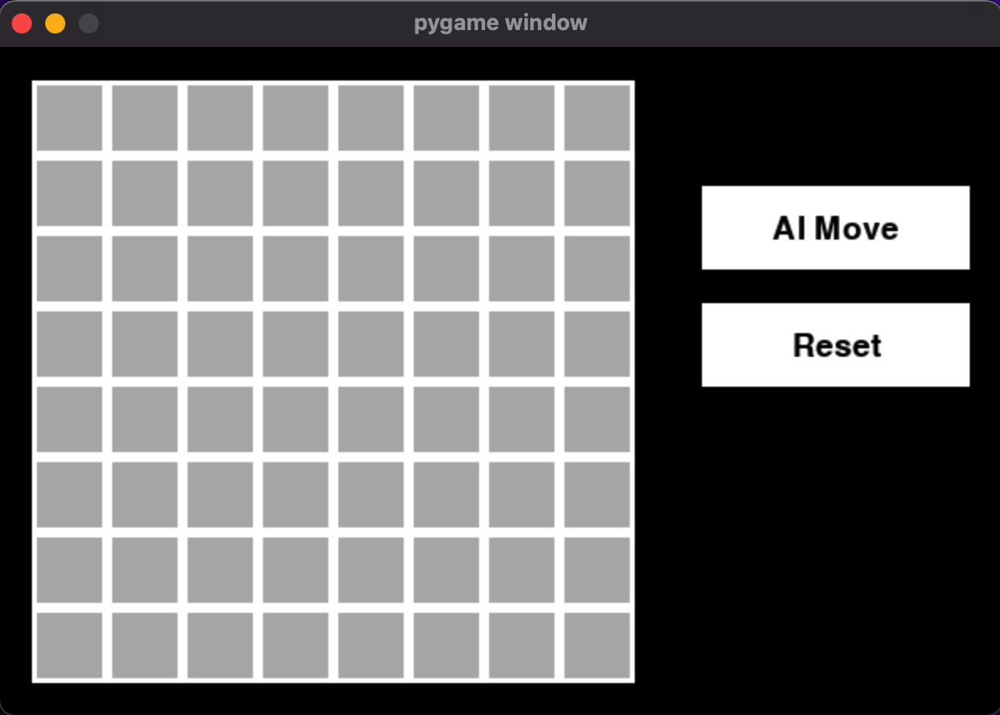
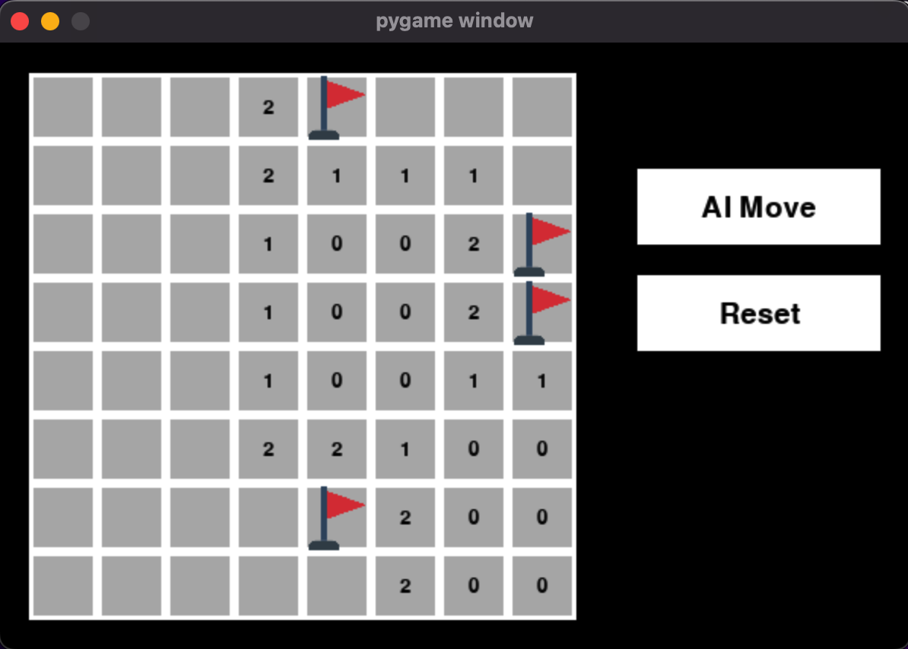
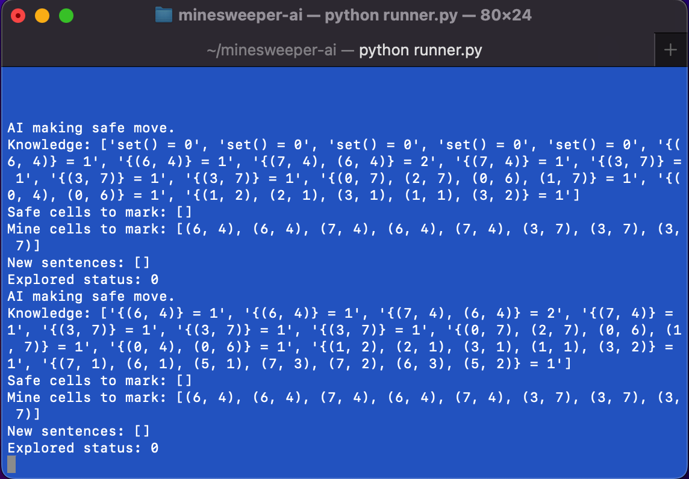

# Classic Minesweeper Game with AI

A Python implementation of the classic Minesweeper game, featuring an AI that can play the game intelligently. The game is built using `pygame` for the graphical interface.

## Features

- **Classic Minesweeper Gameplay**: Play the traditional Minesweeper game with customizable board sizes and mine counts.
- **AI Integration**: Watch the AI make safe moves and infer mine locations using logical reasoning.
- **User-Friendly Interface**: A clean and interactive UI built with `pygame`.

## Screenshots

### Welcome Screen


### Start of Game


### Gameplay


### AI Making Moves


## How to Play

1. **Start the Game**: Run the `runner.py` file to launch the game, press "Play Game" button.
2. **Gameplay**:
   - Left-click to reveal a cell.
   - Right-click to flag a cell as a mine.
   - Use the "AI Move" button to let the sweeperAI make a move.
3. **Win Condition**: Flag all mines correctly to win the game.
4. **Lose Condition**: Reveal a mine to lose the game.

## Installation

1. Clone the repository:
   ```bash
   git clone https://github.com/your-username/minesweeper.git
   cd minesweeper
    ```
2. Install dependencies:
    ```bash
    pip install -r requirements.txt
    ```

3. Run the game:
    ```bash
    python runner.py
    ```

## Project Structure
```
.
├── assets/                 # Game assets
│   ├── images/
│   │   ├── flag.png
│   │   └── mine.png
├── minesweeper.py          # Game logic and AI implementation
├── runner.py               # Main game loop and UI
├── requirements.txt        # Python dependencies
├── .gitignore              # Ignored files for Git
├── README.md               # Project documentation
└── screenshots/            # Game Screenshots
```

## Requirements
- Python 3.10 or higher
- `pygame` library

## Controls
- Left-Click: Reveal a cell.
- Right-Click: Flag or unflag a cell.
- AI Move Button: Let the AI make a move.
- Reset Button: Restart the game.

---

<p align="center">
  Project by <a href="https://github.com/ashworth3">@ashworth3</a>
</p>
